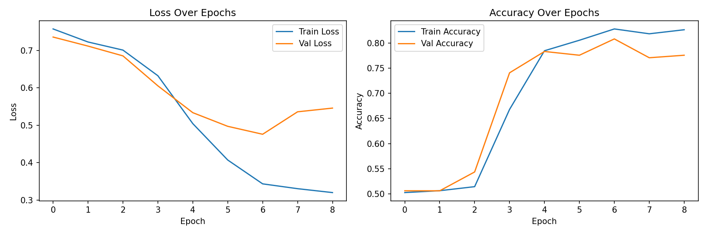
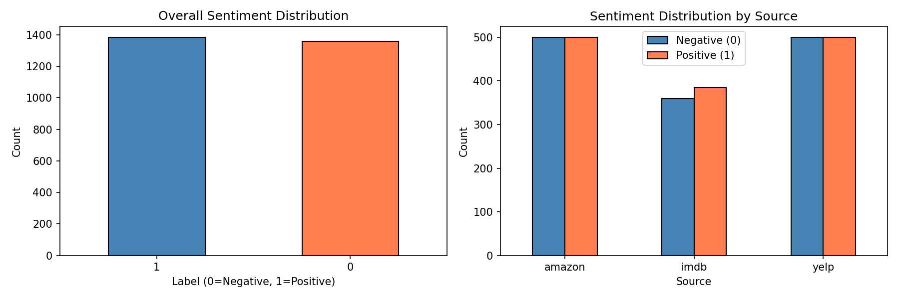
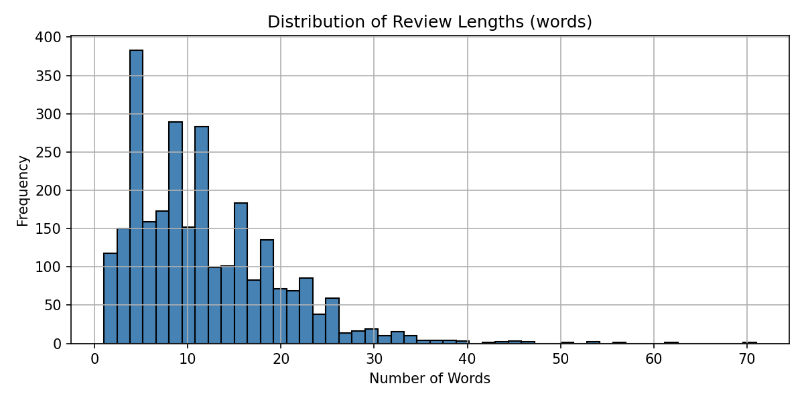
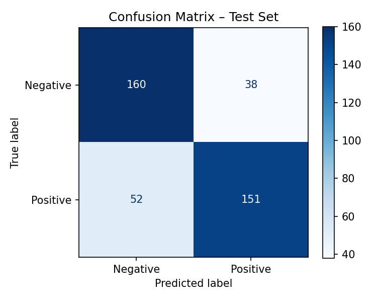

# Sentiment Analysis with a Bidirectional LSTM

A binary sentiment classifier built with TensorFlow/Keras that labels short product, restaurant, and movie reviews as **positive** or **negative**. The project covers the full NLP pipeline — from raw-text noise reduction through tokenization, vectorization, and padding, to a regularized Bidirectional LSTM trained with early stopping — and emphasizes building a model that *generalizes* rather than one that simply maximizes a benchmark.



---

## Table of Contents
- [Overview](#overview)
- [Dataset](#dataset)
- [Pipeline](#pipeline)
- [Model Architecture](#model-architecture)
- [Results](#results)
- [Key Design Decisions](#key-design-decisions)
- [Recommendations for Future Work](#recommendations-for-future-work)
- [Repository Structure](#repository-structure)
- [How to Run](#how-to-run)
- [Tech Stack](#tech-stack)
- [References](#references)

---

## Overview

**Research question:** Can a Bidirectional LSTM, trained on labeled reviews from three different domains, accurately classify the sentiment of unseen text as positive or negative?

The model reaches **77.6% test accuracy** on a held-out set, with balanced per-class performance (F1 ≈ 0.78 for both classes) and — importantly — only a small gap between training and validation accuracy, indicating the model learned generalizable patterns instead of memorizing the training data.

> **Note on data:** The raw datasets have been **removed from this repository for data-ethics reasons**. The trained model artifacts, the fitted tokenizer, the processed-data pipeline code, and all generated figures are retained so the analysis remains fully transparent and the results are inspectable. The original data is publicly available from the source cited in [References](#references).

---

## Dataset

The analysis uses the labeled sentiment sentences from Kotzias et al. (2015), combining three sources:

| Source | Domain | Samples |
|---|---|---|
| Amazon | Product reviews | 1,000 |
| Yelp | Restaurant reviews | 1,000 |
| IMDb | Movie reviews | 743 |
| **Combined (raw)** | | **2,743** |

Labels are binary (1 = positive, 0 = negative) and the combined set is nearly balanced (50.5% positive / 49.5% negative). After deduplication and noise removal, **2,672 samples** remained.



---

## Pipeline

The text preprocessing applies nine sequential noise-reduction steps:

1. **Lowercasing** — collapses casing variants into one token
2. **Emoji removal** — Unicode-range regex (none present in this corpus, retained for robustness)
3. **Non-ASCII stripping** — removes accented/non-English characters
4. **Punctuation normalization** — replaces punctuation with spaces
5. **Numeric removal** — drops standalone numbers that carry no sentiment
6. **Stopword removal** — drops 179 high-frequency function words (NLTK)
7. **Tokenization** — NLTK `word_tokenize`
8. **Lemmatization** — WordNet lemmatizer reduces words to base forms
9. **Empty/duplicate removal** — drops degenerate and repeated rows

This reduced the vocabulary from **6,802 → 4,263 unique tokens** (a 37% reduction), surfacing sentiment-bearing words like *good*, *great*, and *bad* as the most frequent tokens.



**Tokenization & vectorization:** The Keras `Tokenizer` maps each word to an integer index, with `VOCAB_SIZE` set dynamically to the *actual* fitted vocabulary (4,264) rather than an arbitrary cap — avoiding thousands of unused embedding slots. A trainable 64-dimensional `Embedding` layer learns dense word vectors end-to-end.

**Sequence length:** Set to **13 tokens** (the 95th percentile of review lengths), covering 95% of reviews in full while keeping padding overhead low. Padding is applied **post** (trailing zeros) so the LSTM processes meaningful tokens before padding.

**Split:** 70% train / 15% validation / 15% test, stratified to preserve class balance, with a fixed seed (42) for reproducibility.

---

## Model Architecture

| Layer (type) | Output Shape | Params |
|---|---|---|
| Embedding | (None, 13, 64) | 272,896 |
| Bidirectional LSTM (8 units/direction) | (None, 16) | 4,672 |
| Dropout (0.3) | (None, 16) | 0 |
| Dense (2, ReLU) | (None, 2) | 34 |
| Dropout (0.3) | (None, 2) | 0 |
| Dense (1, Sigmoid) | (None, 1) | 3 |
| **Total** | | **277,605** |

The recurrent and dense layers are deliberately **small** (8 LSTM units, a 2-unit dense bottleneck). With only ~1,870 training samples, a larger network memorizes the data almost immediately. Constraining capacity — combined with dropout (0.3), L2 regularization (λ=1e-3), and early stopping — was the central strategy for controlling overfitting.

---

## Results

**Test accuracy: 77.6%** &nbsp;|&nbsp; **Test loss: 0.533**

| Class | Precision | Recall | F1 | Support |
|---|---|---|---|---|
| Negative | 0.75 | 0.81 | 0.78 | 198 |
| Positive | 0.80 | 0.74 | 0.77 | 203 |
| **Accuracy** | | | **0.78** | 401 |



Training ran 9 epochs before early stopping restored the best checkpoint (epoch 7, peak validation accuracy 80.8%). The near-symmetric precision/recall across both classes confirms the model does not favor one sentiment — consistent with the balanced dataset. The gap between training accuracy (~83%) and test accuracy (~78%) is small, the direct payoff of the capacity-constrained design.

---

## Key Design Decisions

A few choices that shaped the outcome:

- **Capacity matched to data, not maximized.** The first instinct in deep learning is to add capacity. Here, the opposite was correct: shrinking the LSTM from 64 → 8 units and the dense layer to a 2-unit bottleneck cut the train/validation gap dramatically. On a ~1,870-sample dataset, a smaller model that generalizes beats a larger one that memorizes.
- **Vocabulary sized to the data.** Setting `VOCAB_SIZE` to the true fitted vocabulary (4,264) rather than a stock 10,000 cap removed ~5,700 dead embedding rows — a small but principled efficiency gain.
- **Reproducibility built in.** Fixed seeds, a saved tokenizer, and a dataset-comparison check (which flags whether a rerun reproduces the exact processed arrays) make the results auditable.
- **Honest evaluation.** Per-class precision/recall/F1 are reported alongside overall accuracy, since accuracy alone can hide class-level bias.

---

## Recommendations for Future Work

Two concrete, complementary directions would attack the core constraint — limited training data relative to model capacity — and likely push accuracy past 80%:

**1. Data augmentation via synonym replacement.**
With only ~1,870 training samples, enlarging the effective training set is the highest-leverage move. Randomly swapping a fraction of words in training reviews with WordNet synonyms (available through NLTK) generates plausible new variants, exposing the model to more lexical variety without manual labeling. Applied to the training split only, it carries no leakage risk.

**2. Pretrained word embeddings (GloVe).**
Instead of learning all 272,896 embedding parameters from scratch on a small corpus, the embedding layer could be initialized with GloVe vectors trained on billions of words. Words like *excellent* and *wonderful* would start near each other in vector space, sharply reducing what must be learned from the limited data. The embeddings can be frozen to preserve pretrained semantics or fine-tuned at a low learning rate.

Together: augmentation increases the data, pretrained embeddings reduce the data needed.

---

## Repository Structure

```
.
├── sentiment_analysis.ipynb      # End-to-end notebook
├── output/
│   ├── best_model.keras          # Trained model (retained)
│   ├── tokenizer.pkl             # Fitted tokenizer (retained)
│   ├── history.pkl               # Training history for curves
│   └── processed_dataset.pkl     # Processed pipeline output
├── figures/
│   ├── eda_label_distribution.png
│   ├── eda_review_lengths.png
│   ├── training_curves.png
│   └── confusion_matrix.png
└── README.md
```

> The raw dataset files are intentionally **not** included (see the note in [Overview](#overview)).

---

## How to Run

```bash
# Install dependencies
pip install tensorflow nltk scikit-learn pandas numpy matplotlib seaborn

# Launch the notebook
jupyter notebook sentiment_analysis.ipynb
```

The notebook auto-detects a saved model: if `output/best_model.keras` exists, it loads it and skips training; otherwise it trains from scratch and saves all artifacts. To reproduce training from zero, delete the files in `output/` and rerun.

> To run end-to-end you will need the original dataset files, available from the source in [References](#references).

---

## Tech Stack

`Python` · `TensorFlow / Keras` · `NLTK` · `scikit-learn` · `pandas` · `NumPy` · `Matplotlib`

---

## References

- Kotzias, D., Denil, M., de Freitas, N., & Smyth, P. (2015). *From Group to Individual Labels Using Deep Features.* KDD 2015. [Link](https://dl.acm.org/doi/10.1145/2783258.2783380)
- Hochreiter, S., & Schmidhuber, J. (1997). *Long Short-Term Memory.* Neural Computation, 9(8).
- Schuster, M., & Paliwal, K. K. (1997). *Bidirectional Recurrent Neural Networks.* IEEE Transactions on Signal Processing, 45(11).
- Chollet, F. (2021). *Deep Learning with Python* (2nd ed.). Manning.
